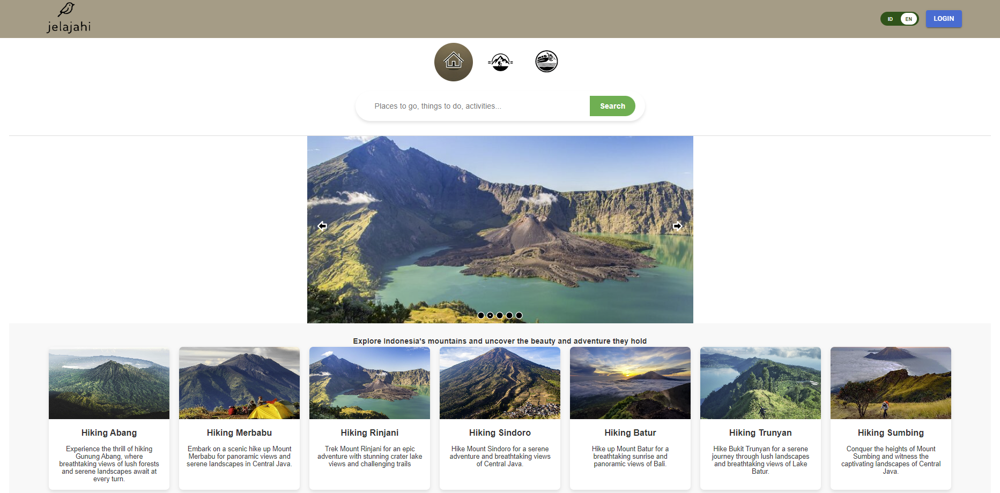
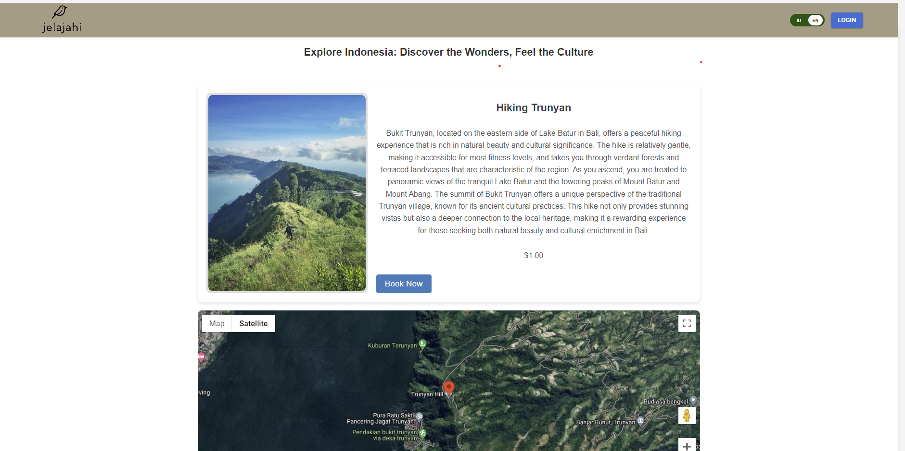
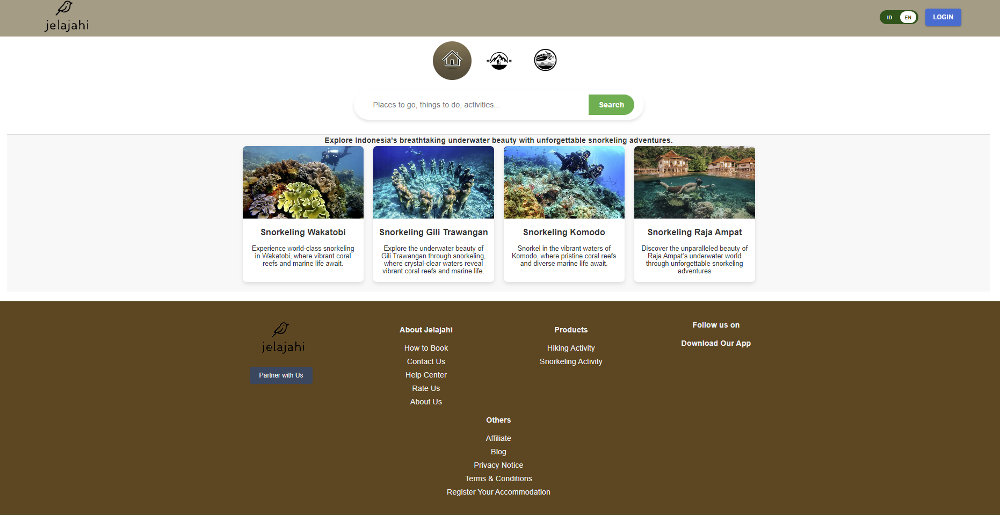

# Indonesia Hiking Explorer

Welcome to **Indonesia Hiking Explorer**, a fun and collaborative project dedicated to creating a comprehensive website for exploring hiking activities across Indonesia. This project is built using modern web technologies such as React, Node.js, Django, and PostgreSQL. Our goal is to provide a rich, interactive platform where users can discover, share, and plan hiking adventures throughout the diverse landscapes of Indonesia.
# INFO
Currrently the project for website is stopped, because we are trying to develop the android application. Repo is also available publicly on 'Jelajahi'
# PREVIEW

